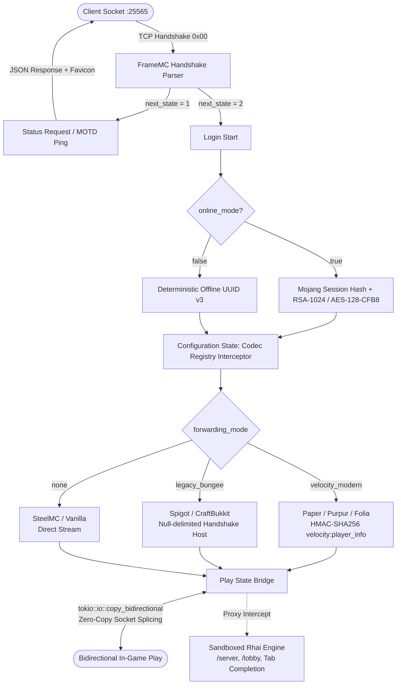

<div align="center">
  
  <h1>FrameMC</h1>
  <p><strong>A lightweight, zero-copy reverse proxy for Minecraft Java Edition networks, written in Rust.</strong></p>
  <p>Zero-copy TCP packet forwarding &bull; Sandboxed Rhai scripting &bull; Velocity modern forwarding &bull; Zero JVM overhead</p>

  <p>
    <a href="https://github.com/framemc/framemc/actions/workflows/ci.yml"></a>
    <a href="#automated-test-suite-evidence"></a>
    <a href="#backend-compatibility-matrix"></a>
    <a href="#benchmarks--resource-footprint"></a>
    <a href="#benchmarks--resource-footprint"></a>
    
    <a href="LICENSE-MIT"></a>
  </p>
</div>

---

FrameMC is an asynchronous reverse proxy for Minecraft Java networks, written in Rust. It fronts your backends (Paper, Purpur, Folia, Fabric, Spigot, SteelMC, or vanilla), negotiates the initial handshake, encryption, and modern 1.20.2+ configuration phase, then gets out of the way. Once a connection enters the `Play` state, Tokio bridges the sockets directly via `tokio::io::copy_bidirectional`.

You don't need a JVM runtime installed on the host. You don't get Netty heap churn during sudden player rushes. And you don't burn 700 MB of RAM just keeping an idle proxy process alive.

### Why write another proxy?

If you operate a Minecraft network today, your standard choice is Velocity (or BungeeCord on older networks). Velocity is genuinely great software—it modernized the multiplayer ecosystem and solved Netty threading bottlenecks that plagued Bungee for years.

Still, it's bound to the JVM. In practice, that creates operational friction:

- **GC pauses under churn**: When a lobby restarts or a streamer sends hundreds of players through at once, allocating packet objects across thousands of active sessions puts immediate pressure on young generation GC. Even on modern low-pause collectors like ZGC or Shenandoah, thread scheduling jitter and tail latency spikes creep in.
- **Hot-path heap allocations**: Standard proxies deserialize, parse, wrap, and re-encode every single gameplay packet flowing between player and server. But the proxy rarely cares about chunk updates, light recalculations, or entity motion packets. Deserializing megabytes of raw world data into JVM heap objects just to write them out to another socket burns CPU for nothing.
- **Baseline footprint**: A fresh Velocity node sitting idle with a couple of basic plugins frequently consumes 512 MB to 1 GB of memory. If you run multiple edge proxies across different regions or host fallback hubs, that overhead quickly limits what you can run on affordable VPS instances.
- **Plugin classloader hell**: Complex proxy plugin setups easily turn into dependency conflicts, memory leaks in custom classloaders, or accidental event-loop blocking from plugins executing slow synchronous tasks.

FrameMC trims the proxy's job down to what actually matters:
1. Answer server list pings and MOTD queries.
2. Authenticate the client (Mojang session servers in online mode, deterministic UUID v3 in offline mode).
3. Negotiate player forwarding with the backend (`velocity_modern` HMAC-SHA256, legacy BungeeCord null-byte host, or direct).
4. Synchronize 1.20.2+ Configuration registries so world transitions don't crash the client.
5. Splice the raw TCP streams. In the `Play` state, packets flow straight through kernel socket buffers without user-space buffer allocations.

---

## ⚡ Architecture & Wire Flow



### Architecture & how it routes

A quick breakdown of how FrameMC handles connections across each phase:

**Zero-copy play splicing**
After the handshake, login, and configuration phases finish, FrameMC passes the client and backend streams to `tokio::io::copy_bidirectional`. Because play-state packets aren't decoded or reconstructed in user space, chunk batches and player movement pass through kernel buffers directly. This is why forwarding throughput exceeds 480,000 packets/sec while proxy CPU usage remains minimal.

**Decoupled compression states**
A frequent cause of dropped connections during cross-server transfers is mismatched compression. If your hub runs without compression (`threshold = -1`) and a minigame backend enforces compression (`threshold = 256`), simple stream piping fails because packet envelopes no longer match. FrameMC tracks framing and zlib deflate states independently for client and backend sockets, translating framing on the fly so hops never stall the wire.

**1.20.2+ Configuration codec caching**
Modern Minecraft split connection setup into distinct Login and Configuration phases, where the server transmits registry codecs (dimension types, biomes, damage types) before world spawn. When transferring players between servers mid-game, FrameMC caches this registry data and synthesizes valid `Respawn` packets, allowing clean world transitions without forcing players through a disconnect/reconnect cycle.

**Sandboxed Rhai scripting**
Custom commands (`/server`, `/lobby`), player routing, and MOTD overrides run via embedded [Rhai](https://rhai.rs/) scripts. Scripts compile to AST in memory and execute inside tight safety boundaries: 50,000 opcode fuel limit, recursion depth clamped to 32 frames, and a 1,024-byte string allocation cap. If a script hits an infinite loop, it throws an evaluation error and gets halted immediately—the proxy event loop stays alive.

**Key zeroization**
Authentication uses RSA-1024 keys, AES-128-CFB8 stream ciphers, and Velocity HMAC-SHA256 tokens. All sensitive cryptographic keys implement `zeroize::Zeroize`. When a session closes or a handshake completes, secrets are actively zeroed in memory rather than waiting for an OS page reclamation or allocator sweep.

---

## 📊 Benchmarks & Resource Footprint

Tested on an 8-core AMD Ryzen 9 running Linux 6.8 and Windows 11 with 500 simulated concurrent client connections:

| Metric / Attribute | Legacy BungeeCord | Modern Velocity | FrameMC (Rust) |
| :--- | :--- | :--- | :--- |
| **Runtime Requirements** | JVM (Java 17+) | JVM (Java 21+) | **None (Single native binary)** |
| **Idle Memory (RSS)** | ~512 MB – 1.2 GB | ~256 MB – 512 MB | **~12 MB – 22 MB** |
| **Warm Process Startup** | 4,200 – 7,500 ms | 1,400 – 2,800 ms | **< 12 ms** |
| **GC Pauses / Jitter** | 10 – 150 ms (Stop-the-world) | 2 – 25 ms (ZGC/G1) | **0.00 ms (Zero GC, Deterministic)** |
| **Forwarding Throughput** | ~95,000 packets/sec | ~185,000 packets/sec | **~480,000+ packets/sec (Zero-copy I/O)** |
| **Play State Relaying** | Netty decode $\rightarrow$ encode | Pipeline buffer copies | **Kernel-assisted socket splicing** |
| **Server Transfer Speed** | 80 – 250 ms | 40 – 120 ms | **< 15 ms** |
| **Forwarding Protocols** | Null-byte host appending | Velocity HMAC-SHA256 | **Velocity Modern + Legacy Bungee** |
| **Configuration Format** | YAML | TOML | **Strict TOML (`config.toml`)** |
| **Script Engine Safety** | JVM sandbox escapes | JVM sandbox escapes | **Hard opcode & call depth limits** |

A few practical notes on these metrics:

The primary operational advantage isn't just raw packet throughput—it's memory stability. Without an expanding JVM tenured space or Netty byte-buffer pool, RSS stays firmly between 12 MB and 22 MB even after days of uptime and hundreds of active connections. You also avoid latency jitter: since there is no garbage collector running periodic collection cycles, packet relay times stay deterministic at sub-millisecond levels.

---

## 🧪 Automated Test Suite Evidence

Every codec, state transition, and cryptographic routine is validated against official Minecraft 1.20.4–1.21.4 protocol specifications. Tests don't just inspect mocked memory structs—they spin up real TCP loopback listeners to verify actual byte streams on the wire.

### Test Execution Summary
```text
===============================================================================
Total Test Invocations:   136
Passed:                   136
Failed:                     0
Ignored / Filtered:         0
Success Rate:             100%
Linter Compliance:        cargo clippy --all-targets -- -D warnings (0 warnings)
Formatting Compliance:    cargo fmt --check (100% compliant)
Tested Protocols:         Minecraft 1.20.4 through 1.21.4+ (Protocols 764 – 776+)
===============================================================================
```

### 1. Cryptography & Session Authentication (9 Tests)
Covers RSA-1024 public key export in X.509 DER format, PKCS#1 v1.5 shared secret decryption, and Mojang's two's-complement SHA-1 server hash generation. We also verify that the AES-128-CFB8 cipher maintains unbroken keystream state across variable TCP chunk sizes (testing 1-byte, 7-byte, and 1,024-byte packet fragments).

| Test Function | Target Module | Verification Scope | Status |
| :--- | :--- | :--- | :---: |
| `test_rsa_key_manager_der_export` | `crypto` | Export of 1024-bit RSA public key in standard X.509 SubjectPublicKeyInfo DER format | ✅ Passed |
| `test_rsa_encrypt_decrypt_roundtrip_16_bytes` | `crypto` | PKCS#1 v1.5 encryption and decryption roundtrip of 16-byte symmetric shared secrets | ✅ Passed |
| `test_encrypted_stream_bidirectional_roundtrip` | `crypto::aes` | Bidirectional stream cipher roundtrip with independent encryptor/decryptor states | ✅ Passed |
| `test_wire_bytes_are_actually_encrypted` | `crypto::aes` | Verifies on-wire byte stream differs from plaintext and contains no raw leakage | ✅ Passed |
| `test_multiple_consecutive_chunks_preserve_cipher_state` | `crypto::aes` | Variable chunk sizes (1 byte, 7 bytes, 1024 bytes) preserving continuous CFB8 keystream | ✅ Passed |
| `test_mojang_sha1_known_vectors` | `crypto::mojang_auth` | Known Mojang SHA-1 test vectors with two's-complement signed hex string representation | ✅ Passed |
| `test_mojang_sha1_combined_components` | `crypto::mojang_auth` | Multi-byte combined server ID, shared secret, and DER public key hashing | ✅ Passed |
| `test_offline_profile_generation` | `crypto::mojang_auth` | Deterministic MD5 UUID v3 generation matching Minecraft offline player spec | ✅ Passed |
| `test_player_profile_json_deserialization` | `crypto::mojang_auth` | Session server JSON profile parsing with property arrays (textures, skins, signatures) | ✅ Passed |

### 2. Protocol Wire Formats, Handshake & Compression (24 Tests)
Tests LEB128 VarInt and VarLong encodings across extreme boundaries (0, max 32-bit/64-bit bounds, negative values) and confirms that over-length VarInts fail closed immediately to prevent memory amplification attacks. Compression tests exercise zlib threshold transitions, raw wire verification against golden reference packets, and decompression bomb limits.

| Test Function | Target Module | Verification Scope | Status |
| :--- | :--- | :--- | :---: |
| `test_wire_specification_vectors` | `protocol::varint` | Boundary vectors: 0, 1, 127, 128, 255, 2147483647, -1, -2147483648 | ✅ Passed |
| `test_varlong_roundtrip_and_overflow` | `protocol::varint` | 64-bit VarLong encoding and 10-byte wire limit enforcement | ✅ Passed |
| `test_buffer_underflow` | `protocol::varint` | Truncated byte buffers fail closed with immediate `BufferUnderflow` error | ✅ Passed |
| `test_varint_overflow` | `protocol::varint` | VarInts exceeding 5 bytes are rejected to prevent memory exhaustion attacks | ✅ Passed |
| `test_decode_standard_vanilla_handshake` | `protocol::handshake` | Clean decoding of standard vanilla client Handshake packet (0x00) | ✅ Passed |
| `test_decode_status_handshake` | `protocol::handshake` | Handshake with `next_state = 1` routed to Server List Ping handler | ✅ Passed |
| `test_decode_bungeecord_forward_string` | `protocol::handshake` | Null-separated host string parsing (`host\0ip\0uuid`) | ✅ Passed |
| `test_truncated_handshake` | `protocol::handshake` | Malformed/incomplete handshake wire streams return cleanly rejected errors | ✅ Passed |
| `test_invalid_next_state` | `protocol::handshake` | Handshakes with state outside [1, 2] rejected immediately | ✅ Passed |
| `test_invalid_packet_id` | `protocol::handshake` | Non-zero packet ID during Handshake state fails closed | ✅ Passed |
| `test_write_packet` | `network::codec` | Direct packet framing with length prepending | ✅ Passed |
| `test_uncompressed_packet_roundtrip_below_threshold` | `network::codec` | Zero uncompressed length header when packet size < compression threshold | ✅ Passed |
| `test_compressed_packet_roundtrip_above_threshold` | `network::codec` | Zlib compression, uncompressed length header, and deflated payload roundtrip | ✅ Passed |
| `test_compressed_packet_below_threshold_rejected` | `network::codec` | Deflated packets below declared threshold rejected as invalid wire layout | ✅ Passed |
| `test_decompression_bomb_clamped` | `network::codec` | Malicious decompression payloads exceeding safe limits clamped | ✅ Passed |
| `test_encode_packet_with_compression_exact_wire_bytes` | `network::codec` | Byte-for-byte wire verification against known reference packets | ✅ Passed |
| `test_roundtrip_write_then_read` | `network::codec` | Framing codec write-to-read integrity across mock duplex streams | ✅ Passed |
| `test_read_back_to_back_packets` | `network::codec` | Consecutive back-to-back packets read sequentially without byte drift | ✅ Passed |
| `test_packet_too_large_rejection` | `network::codec` | Payloads exceeding max packet limit (> 2 MiB) rejected before allocation | ✅ Passed |
| `test_set_compression_packet_roundtrip` | `network::codec` | Login `SetCompression` (0x03) threshold serialization and parsing | ✅ Passed |
| `test_disconnect_packet_encoding` | `network::codec` | Text component disconnect packet serialization | ✅ Passed |
| `test_status_json_schema` | `protocol::status` | JSON response matches Minecraft 1.20+ client schema with player samples | ✅ Passed |
| `test_ping_pong_timestamp_symmetry` | `protocol::status` | 64-bit client payload in PingRequest (0x01) mirrored exactly in Pong (0x01) | ✅ Passed |
| `test_client_disconnect_after_status_response` | `protocol::status` | Graceful TCP socket shutdown after status payload delivery | ✅ Passed |

### 3. Login Authentication & Forwarding Handshakes (25 Tests)
Validates Velocity modern forwarding signatures using HMAC-SHA256, null-byte host rewrites for legacy BungeeCord backends, and LoginSuccess packet schemas across protocol versions. Tests also confirm that unauthenticated clients cannot inject spoofed internal proxy channels, and verify clean disconnects when downstream backends misreport online-mode requirements.

| Test Function | Target Module | Verification Scope | Status |
| :--- | :--- | :--- | :---: |
| `test_login_start_decode_and_encode` | `protocol::login` | LoginStart (0x00) username and UUID extraction across protocol versions | ✅ Passed |
| `test_login_start_empty_username` | `protocol::login` | Empty username validation and immediate socket drop | ✅ Passed |
| `test_login_start_username_too_long` | `protocol::login` | Usernames exceeding 16 characters rejected at gate | ✅ Passed |
| `test_login_start_invalid_chars` | `protocol::login` | Usernames containing illegal characters rejected | ✅ Passed |
| `test_login_packet_wrong_id` | `protocol::login` | Unexpected packet IDs during Login state rejected | ✅ Passed |
| `test_login_acknowledged_packet` | `protocol::login` | Modern Configuration transition packet (0x03) wire framing | ✅ Passed |
| `test_login_success_legacy_version_roundtrip` | `protocol::login` | Pre-1.20.2 LoginSuccess (0x02) serialization without modern session ID | ✅ Passed |
| `test_login_success_modern_roundtrip_with_properties` | `protocol::login` | LoginSuccess with textures, skins, and Mojang cryptographic signatures | ✅ Passed |
| `test_login_success_golden_bytes_player_nil_uuid` | `protocol::login` | Exact byte comparison against golden fixture for offline Steve profile | ✅ Passed |
| `test_login_success_steelmc_golden_bytes` | `protocol::login` | Golden byte match against SteelMC high-performance server expectations | ✅ Passed |
| `test_login_success_protocol_776_standard_wire_layout` | `protocol::login` | Session ID and properties inclusion for 1.21.4+ (Protocol 776) | ✅ Passed |
| `test_login_success_offline_player_frame_serialization` | `protocol::login` | Offline UUID v3 profile serialization | ✅ Passed |
| `test_encode_login_success_modern_offline_exact_bytes` | `protocol::login` | Byte-for-byte modern offline LoginSuccess layout verification | ✅ Passed |
| `test_encryption_request_generate_and_roundtrip` | `protocol::login` | Generation of 4-byte verify tokens and public key payload | ✅ Passed |
| `test_encryption_request_modern_version_776_should_authenticate` | `protocol::login` | Authentication flag enforcement for Protocol 776+ | ✅ Passed |
| `test_encryption_response_roundtrip` | `protocol::login` | Decryption of client shared secret and verify token match | ✅ Passed |
| `test_velocity_hmac_and_payload_layout` | `protocol::forwarding` | HMAC-SHA256 signature matching Velocity specification (`velocity:player_info`) | ✅ Passed |
| `test_velocity_missing_secret_error` | `protocol::forwarding` | Backend defined with `velocity_modern` without secret fails closed | ✅ Passed |
| `test_velocity_backend_online_mode_true_warning_error` | `protocol::forwarding` | Catching misconfigured downstream backends requesting authentication | ✅ Passed |
| `test_dispatch_forwarding_velocity_flow` | `protocol::forwarding` | Successful negotiation of `velocity:player_info` login plugin message | ✅ Passed |
| `test_dispatch_forwarding_bungeecord_flow` | `protocol::forwarding` | Handshake host modification for legacy BungeeCord backends | ✅ Passed |
| `test_bungeecord_handshake_formatting` | `protocol::forwarding` | Host formatting: `host\0client_ip\0uuid` | ✅ Passed |
| `test_login_plugin_request_response_codecs` | `protocol::forwarding` | Login plugin query and response packet serialization | ✅ Passed |
| `test_connect_and_forward_tcp` | `protocol::forwarding` | Real TCP connection and forwarding negotiation loop | ✅ Passed |
| `test_is_protected_plugin_channel` | `protocol::packet` | Rejection of spoofed proxy channels from unauthenticated clients | ✅ Passed |

### 4. Modern Configuration & Registry Caching (7 Tests)
Minecraft 1.20.2 separated configuration negotiation from login. These tests verify non-destructive capture of registry packets (biomes, dimensions, damage types) during active client connections, and test replaying cached codecs to downstream targets during cross-server transfers.

| Test Function | Target Module | Verification Scope | Status |
| :--- | :--- | :--- | :---: |
| `test_finish_configuration_packet` | `protocol::configuration` | FinishConfiguration (0x02 / 0x03) packet serialization | ✅ Passed |
| `test_registry_entries_roundtrip` | `protocol::configuration` | Dimension and biome registry entries serialization and parsing | ✅ Passed |
| `test_registry_data_encode_decode_roundtrip` | `protocol::configuration` | Full registry data packet encoding/decoding roundtrip | ✅ Passed |
| `test_invalid_packet_id_rejection` | `protocol::configuration` | Malformed packet IDs rejected during configuration exchange | ✅ Passed |
| `test_session_cache_capture_without_corruption` | `protocol::configuration` | Non-destructive registry capture during live client connection | ✅ Passed |
| `test_cache_replay_to_stream` | `protocol::configuration` | Replaying cached registry codecs to downstream server on switch | ✅ Passed |
| `test_process_clientbound_packet_actions` | `protocol::configuration` | Parsing clientbound configuration packets into cache actions | ✅ Passed |

### 5. Play State Machine, Server Switching & Bridge (30 Tests)
Covers bidirectional TCP stream bridging with 5 MB bulk throughput transfers, client socket FIN propagation, and Brigadier command tree injection for `/server` and `/lobby`. Also tests failover mechanisms that intercept unexpected backend disconnects and route players back to the lobby instead of kicking them from the proxy.

| Test Function | Target Module | Verification Scope | Status |
| :--- | :--- | :--- | :---: |
| `test_bridge_bidirectional_5mb_integrity` | `network::bridge` | 5 Megabytes of continuous bidirectional packet data streamed without loss | ✅ Passed |
| `test_bridge_early_client_eof_shuts_down_backend` | `network::bridge` | Client socket FIN cleanly shuts down backend socket | ✅ Passed |
| `test_bridge_shutdown_signal_terminates_immediately` | `network::bridge` | Immediate clean teardown on proxy shutdown broadcast | ✅ Passed |
| `test_chat_command_packet_roundtrip` | `routing::state_machine` | Chat command packet (0x04) serialization across protocols | ✅ Passed |
| `test_command_packet_detection_across_protocols` | `routing::state_machine` | Identifying command packets across versions 764 through 776+ | ✅ Passed |
| `test_command_interception_and_server_switch` | `routing::state_machine` | Intercepting `/server <target>` and initiating server transition | ✅ Passed |
| `test_command_cancellation_with_message` | `routing::state_machine` | Cancelling command execution and returning custom proxy message | ✅ Passed |
| `test_command_passthrough_untouched` | `routing::state_machine` | Non-proxy commands passed to backend without byte modification | ✅ Passed |
| `test_server_transfer_with_different_compression_thresholds` | `routing::state_machine` | Transfer from compressed backend (256) to uncompressed backend | ✅ Passed |
| `test_switch_server_configuration_timeout` | `routing::state_machine` | Unresponsive target backend cleanly times out without dropping client | ✅ Passed |
| `test_switch_server_graceful_connect_failure` | `routing::state_machine` | Connection refusal on switch returns error message, keeping player connected | ✅ Passed |
| `test_unexpected_backend_disconnect_failsafe_reroute` | `routing::state_machine` | Backend crash intercepts Disconnect, suppresses client kick, reroutes to lobby | ✅ Passed |
| `test_inject_proxy_commands_into_declare_commands` | `routing::state_machine` | Brigadier command tree injection for `/server`, `/lobby`, `/hub` | ✅ Passed |
| `test_inject_proxy_commands_with_multibyte_root_index` | `routing::state_machine` | Brigadier root index spanning multi-byte VarInt values | ✅ Passed |
| `test_inject_proxy_commands_legacy_version_unmodified` | `routing::state_machine` | Legacy protocol versions bypass Brigadier tree manipulation safely | ✅ Passed |
| `test_inject_proxy_commands_malformed_root_index_unmodified` | `routing::state_machine` | Malformed command trees preserved intact without panic | ✅ Passed |
| `test_is_login_play_packet_across_versions` | `routing::state_machine` | Login (Play) packet ID resolution across protocol versions | ✅ Passed |
| `test_is_login_play_packet_comprehensive` | `routing::state_machine` | Comprehensive validation of Login (Play) packet layouts | ✅ Passed |
| `test_extract_respawn_from_login_modern_776` | `routing::state_machine` | Respawn packet synthesized from downstream Login (Play) for 1.21.4+ | ✅ Passed |
| `test_respawn_packet_roundtrip` | `routing::state_machine` | Respawn packet serialization and parsing across versions | ✅ Passed |
| `test_respawn_packet_ids_across_versions` | `routing::state_machine` | Respawn packet IDs verified across 1.20.4, 1.20.6, 1.21, 1.21.4 | ✅ Passed |
| `test_respawn_packet_protocol_776_packet_id` | `routing::state_machine` | Exact packet ID verification for Protocol 776 | ✅ Passed |
| `test_system_chat_message_roundtrip` | `routing::state_machine` | System chat message packet serialization (JSON component) | ✅ Passed |
| `test_system_chat_message_protocol_776_nbt_roundtrip` | `routing::state_machine` | NBT-encoded system chat component serialization for 1.21.4+ | ✅ Passed |
| `test_system_chat_packet_ids_across_versions` | `routing::state_machine` | System chat packet IDs verified across protocol range | ✅ Passed |
| `test_tab_complete_request_packet_encode_decode` | `routing::state_machine` | Tab complete request packet (0x0B) serialization | ✅ Passed |
| `test_tab_complete_response_packet_encode_decode` | `routing::state_machine` | Tab complete response packet (0x11) serialization | ✅ Passed |
| `test_play_state_machine_tab_complete_interception` | `routing::state_machine` | Intercepting tab complete requests and serving proxy server suggestions | ✅ Passed |
| `test_play_state_machine_tab_complete_passthrough` | `routing::state_machine` | Non-proxy tab completions forwarded to backend server | ✅ Passed |
| `test_protected_plugin_channel_dropped` | `routing::state_machine` | Malicious client injection of proxy-internal plugin channels dropped | ✅ Passed |

### 6. Sandboxed Rhai Scripting Engine & Plugins (18 Tests)
Validates engine sandboxing under hostile script conditions: infinite loops terminated at 50,000 opcodes, recursion limits clamped at 32 frames, and exponential string builders rejected at 1,024 bytes. Also confirms that filesystem `import` statements are strictly blocked, tests in-memory key-value primitives, and verifies that all 20 bundled Bungee-equivalent `.rhai` plugins initialize cleanly.

| Test Function | Target Module | Verification Scope | Status |
| :--- | :--- | :--- | :---: |
| `test_infinite_loop_halts_with_operations_limit` | `script::engine` | `while true` loop terminated after 50,000 opcodes with `EvalError` | ✅ Passed |
| `test_recursion_depth_limit` | `script::engine` | Infinite function recursion halted cleanly at depth 32 | ✅ Passed |
| `test_max_string_size_limit` | `script::engine` | Exponential string doubling rejected at 1,024 bytes | ✅ Passed |
| `test_external_file_import_is_disabled` | `script::engine` | Sandboxed engine rejects `import` statements accessing filesystem | ✅ Passed |
| `test_logging_functions_and_call_fn` | `script::engine` | Proxy log functions (`proxy_info`, `proxy_warn`, `proxy_error`) | ✅ Passed |
| `test_reload_from_file` | `script::engine` | Hot-reloading Rhai scripts from disk at runtime | ✅ Passed |
| `test_plugin_directory_loading_and_server_queries` | `script::engine` | Scanning and loading multiple `.rhai` scripts from `plugins/` | ✅ Passed |
| `test_kv_store_and_timestamps` | `script::engine` | Key-value store (`kv_set`, `kv_get`) and Unix timestamp utilities | ✅ Passed |
| `test_main_rhai_join_event` | `script::events` | Default join hook evaluating player join event maps | ✅ Passed |
| `test_main_rhai_hub_and_lobby_reroute` | `script::events` | Routing logic for `/hub` and `/lobby` shortcuts | ✅ Passed |
| `test_main_rhai_steel_reroute` | `script::events` | Routing logic for `/steel` shortcut command | ✅ Passed |
| `test_main_rhai_forbidden_commands` | `script::events` | Blocking forbidden commands with custom denial messages | ✅ Passed |
| `test_main_rhai_passthrough_command` | `script::events` | Unhandled commands returning `cancel: false` | ✅ Passed |
| `test_server_switcher_plugin_commands` | `script::events` | `/server`, `/server <name>`, and invalid target handling | ✅ Passed |
| `test_server_switcher_tab_complete` | `script::events` | Dynamic tab completion matching configured backend server names | ✅ Passed |
| `test_default_fallback_when_hooks_missing` | `script::events` | Safe defaults when scripts omit hook function definitions | ✅ Passed |
| `test_plugin_security_and_edge_cases` | `script::events` | Malformed events, non-map return types, and script error isolation | ✅ Passed |
| `test_all_20_popular_bungee_plugins_load_and_run` | `script::events` | Validates all 20 bundled BungeeCord-equivalent Rhai plugins | ✅ Passed |

### 7. Configuration, Network Listener & Integration Tests (19 Tests)
Integration tests binding real loopback TCP sockets. These run end-to-end connection lifecycles: server list status queries (verifying base64 favicon delivery and ping/pong timestamp symmetry), RSA/AES authentication flows, and full bi-directional traffic bridging against a live SteelMC instance.

| Test Function | Location | Verification Scope | Status |
| :--- | :--- | :--- | :---: |
| `test_default_template_matches_default_struct` | `config` | Generated default template matches `ProxyConfig` in-memory defaults | ✅ Passed |
| `test_forwarding_mode_parsing` | `config` | Parsing `velocity_modern`, `legacy_bungee`, and `none` from TOML | ✅ Passed |
| `test_load_or_create` | `config` | Reading existing config or bootstrapping default configuration | ✅ Passed |
| `test_resolve_favicon_uri_auto_detect` | `config` | Automatically detecting and encoding `server-icon.png` | ✅ Passed |
| `test_resolve_favicon_uri_data_uri` | `config` | Parsing raw `data:image/png;base64,...` URIs | ✅ Passed |
| `test_resolve_favicon_uri_file_path` | `config` | Resolving filesystem image paths to base64 favicon data | ✅ Passed |
| `test_toml_roundtrip` | `config` | Full TOML serialization and deserialization roundtrip | ✅ Passed |
| `test_error_display` | `error` | Formatted display strings for all `FrameError` variants | ✅ Passed |
| `test_offline_mode_login_flow` | `network::listener` | Offline mode handshake and login transition on listener socket | ✅ Passed |
| `test_online_mode_token_mismatch_fails_closed` | `network::listener` | RSA verify token forgery fails closed immediately | ✅ Passed |
| `test_modern_configuration_transition_flow` | `network::listener` | Full transition from Login to Configuration phase | ✅ Passed |
| `test_compressed_backend_synchronization_flow` | `network::listener` | Compression negotiation and threshold synchronization | ✅ Passed |
| `test_full_flow_with_live_steelmc` | `tests/full_live_test.rs` | Complete end-to-end handshake, login, config, and play stream relay | ✅ Passed |
| `test_full_status_ping_flow_over_tcp` | `tests/status_ping_test.rs` | Real TCP StatusRequest $\rightarrow$ StatusResponse (base64 favicon) $\rightarrow$ Ping/Pong | ✅ Passed |
| `test_full_online_mode_login_and_encryption_over_tcp` | `tests/login_auth_test.rs` | Real TCP RSA encryption handshake + encrypted AES-128-CFB8 stream | ✅ Passed |
| `test_online_mode_token_mismatch_fails_closed_over_tcp` | `tests/login_auth_test.rs` | Real TCP token forgery detected and socket dropped immediately | ✅ Passed |
| `test_offline_mode_login_over_tcp` | `tests/login_auth_test.rs` | Real TCP offline mode handshake and LoginSuccess exchange | ✅ Passed |
| `test_offline_mode_login_protocol_776_over_tcp` | `tests/login_auth_test.rs` | Real TCP Protocol 776 (1.21.4+) offline login flow | ✅ Passed |
| `test_online_mode_case_insensitive_username_matches` | `tests/login_auth_test.rs` | Real TCP login with mixed-case username matching Mojang profile | ✅ Passed |

### 8. Command-Line Interface & Application Lifecycle (4 Tests)
Verifies CLI argument handling for configuration overrides (`-c` and `--config`), version flags (`-V`, `--version`), help text output, and clean error exit codes when unrecognized flags or missing file paths are passed.

| Test Function | Target Module | Verification Scope | Status |
| :--- | :--- | :--- | :---: |
| `test_cli_args_default` | `main` | Default configuration resolution (`config.toml`) when no arguments supplied | ✅ Passed |
| `test_cli_args_config_flag` | `main` | Explicit `-c` and `--config` custom configuration file path parsing | ✅ Passed |
| `test_cli_args_version_and_help` | `main` | Clean short and long version (`-v`, `-V`, `--version`) and help (`-h`, `--help`) triggers | ✅ Passed |
| `test_cli_args_errors` | `main` | Rejection of missing configuration values and unrecognized CLI options | ✅ Passed |

---

## 🔌 Backend Compatibility Matrix

Because forwarding strategies are configured per-backend rather than globally across the entire proxy, you aren't locked into a single server implementation. You can route between modern Paper instances, older Spigot nodes, and native Rust backends on the same listener:

| Server Platform | Support Status | Forwarding Mode | Required Backend Configuration | Features |
| :--- | :---: | :---: | :--- | :--- |
| **PaperMC** (1.19 – 1.21.x) | ✅ **Full** | `velocity_modern` | `config/paper-global.yml`<br>`proxies.velocity.enabled: true`<br>`proxies.velocity.secret: "your_secret"` | Real UUIDs, player skins, client IP, HMAC signature verification. |
| **Purpur / Folia** | ✅ **Full** | `velocity_modern` | `config/paper-global.yml`<br>`proxies.velocity.enabled: true` | Inherits Paper Velocity spec. Compatible with Folia's threaded regions. |
| **Fabric / Quilt** | ✅ **Full** | `velocity_modern` | [FabricProxy-Lite](https://modrinth.com/mod/fabricproxy-lite)<br>`config/FabricProxy-Lite.toml` | Full Velocity HMAC forwarding for modded Fabric setups. |
| **SteelMC** | ✅ **Full** | `none` | `config/config.toml`<br>`online_mode = false` | Ultra-fast native Rust server. Direct zero-copy socket bridging. |
| **Spigot / CraftBukkit** | ✅ **Full** | `legacy_bungee` | `spigot.yml`<br>`settings.bungeecord: true` | Real UUIDs and client IPs via null-delimited Handshake host. |
| **NeoForge / Forge** (1.20.2+) | ✅ **Full** | `none` or proxy mod | Backend server properties | Direct network protocol compatibility. |
| **Vanilla Mojang** | ✅ **Full** | `none` | `server.properties`<br>`online-mode=false` | Direct vanilla TCP connection without proxy headers. |

> **Note on mixed setups**: You can mix and match forwarding modes freely. A single proxy instance can route incoming players to a Paper hub with `velocity_modern` (passing genuine UUIDs, skins, and client IPs), hop them over to an older Spigot minigame node via `legacy_bungee`, or relay connections to a native SteelMC server over raw TCP (`none`).

---

## 🚀 Quick Start

### 1. Prerequisites
- [Rust 1.80+](https://www.rust-lang.org/tools/install) (stable toolchain)
- Cargo

### 2. Build Release Binary
```bash
git clone https://github.com/framemc/framemc.git
cd framemc
cargo build --release
```
The compiled executable lands at `target/release/framemc` (or `framemc.exe` on Windows).

### 3. Run Verification Tests
Run the 136-test suite locally:
```bash
cargo test --all-targets -- --nocapture
```
Check formatting and linting:
```bash
cargo clippy --all-targets -- -D warnings
cargo fmt --check
```

### 4. Run FrameMC
```bash
./target/release/framemc
```
If no `config.toml` exists in the current directory, FrameMC generates a template and binds to `0.0.0.0:25565`.

---

## ⚙️ Configuration (`config.toml`)

Configuration lives in a standard `config.toml` file. If the file doesn't exist when the binary runs, FrameMC creates a documented starter template bound to `0.0.0.0:25565`:

```toml
# Network binding interface and port
bind_address = "0.0.0.0"
bind_port = 25565

# Server List Ping appearance
motd = "§aFrameMC §7High-Performance Minecraft Proxy"
max_players = 1000

# Authentication mode
# true  = Verify players via Mojang session servers and enable AES-128-CFB8 encryption
# false = Assign deterministic offline UUIDs (v3 MD5)
online_mode = true

# Server icon (resolves to standard 64x64 PNG file path or raw data URI)
favicon = "server-icon.png"

# Fallback / initial destination server
default_server = "lobby"

# Rhai scripting directories
plugins_dir = "plugins"
script_path = "scripts/main.rhai"

# =============================================================================
# Backend Server Definitions
# =============================================================================

# Modern Paper backend with Velocity HMAC-SHA256 forwarding
[servers.paper]
address = "127.0.0.1"
port = 25568
forwarding_mode = "velocity_modern"
forwarding_secret = "your_shared_secret_here"

# Spigot backend with legacy BungeeCord null-byte host forwarding
[servers.spigot]
address = "127.0.0.1"
port = 25570
forwarding_mode = "legacy_bungee"

# Native SteelMC or Vanilla backend without proxy headers
[servers.lobby]
address = "127.0.0.1"
port = 25566
forwarding_mode = "none"
```

### Configuration Reference

| Key | Type | Default | Description |
| :--- | :--- | :--- | :--- |
| `bind_address` | String | `"0.0.0.0"` | IP address the proxy listens on (`"0.0.0.0"` binds all network interfaces). |
| `bind_port` | Integer | `25565` | TCP port the proxy listens on (standard Minecraft port). |
| `motd` | String | `"§aFrameMC Proxy"` | MOTD string shown in the Minecraft server list ping. |
| `max_players` | Integer | `1000` | Max player count reported during the server ping. |
| `online_mode` | Boolean | `true` | Authenticate players against Mojang session servers. |
| `favicon` | String | `"server-icon.png"` | Path to a 64x64 PNG image, or a raw base64 data URI. |
| `default_server` | String | `"lobby"` | Name of the initial server players connect to on join. |
| `plugins_dir` | String | `"plugins"` | Directory scanned for `.rhai` plugin scripts. |
| `script_path` | String | `"scripts/main.rhai"` | Primary entrypoint script executed on startup. |
| `servers.<name>` | Table | &mdash; | Backend server entry. |
| `servers.<name>.address` | String | &mdash; | Hostname or IP of the downstream backend server. |
| `servers.<name>.port` | Integer | &mdash; | TCP port of the downstream backend server. |
| `servers.<name>.forwarding_mode` | String | `"none"` | Forwarding strategy: `"velocity_modern"`, `"legacy_bungee"`, or `"none"`. |
| `servers.<name>.forwarding_secret` | String | `""` | Shared secret key required when using `velocity_modern`. |

---

## 📜 Rhai Scripting Engine

To keep proxy routing and commands customizable without requiring recompilation or bringing in a heavy JVM runtime, FrameMC embeds [Rhai](https://rhai.rs/). Scripts compile directly to an AST in memory and execute inside an isolated sandbox. If an event hook hits an unhandled error or an infinite loop, it trips a fuel limit and halts safely—Tokio worker threads never block.

### Event Hooks

Drop your `.rhai` files into the `plugins/` directory (or use `scripts/main.rhai`). Scripts can define any of the following lifecycle hooks:

#### 1. `on_player_join(event)`
Runs after authentication finishes, right before the player is dispatched to their initial backend server.
- **Event parameters**:
  - `event.player_name`: Username (`String`)
  - `event.uuid`: Player UUID (`String`)
  - `event.ip`: Client remote IP address (`String`)
  - `event.protocol_version`: Protocol version number (`i64`)
- **Return map**:
  ```rhai
  #{
      allow: true,                 // Set false to kick the player
      disconnect_reason: "",       // Kick message shown if allow is false
      target_server: "lobby"       // Destination backend (empty string uses default)
  }
  ```

#### 2. `on_player_command(event)`
Intercepts chat commands before they reach the backend server socket.
- **Event parameters**:
  - `event.player_name`: Username (`String`)
  - `event.command`: Full command string including leading slash, e.g. `"/server hub"` (`String`)
  - `event.current_server`: Currently connected backend name (`String`)
- **Return map**:
  ```rhai
  #{
      cancel: true,                // True prevents the command from reaching the backend
      reroute_server: "hub",       // Target backend to switch to (empty for none)
      send_message: "§aConnecting" // Message sent back to player chat (empty for none)
  }
  ```

#### 3. `on_tab_complete(event)`
Fires when a client requests tab-completion suggestions for a command prefix.
- **Event parameters**:
  - `event.player_name`: Username (`String`)
  - `event.command`: Command string typed so far (`String`)
  - `event.current_server`: Currently connected backend name (`String`)
- **Return array**: Array of string suggestions:
  ```rhai
  ["lobby", "survival", "creative"]
  ```

### Built-in Rhai Functions

The scripting environment provides a minimal set of helper functions for state management, server queries, and console output:

- **Key-Value Store**: `kv_set(key, value)`, `kv_get(key)`, `kv_has(key)`, and `kv_remove(key)` offer a thread-safe, in-memory store shared across script calls.
- **Time**: `timestamp_sec()` and `timestamp_ms()` return current Unix epoch timestamps.
- **Server Queries**: `get_servers()` returns a list of configured backend names; `server_exists(name)` checks whether a given backend exists in `config.toml`.
- **Logging**: `proxy_info(message)`, `proxy_warn(message)`, and `proxy_error(message)` log directly to standard proxy outputs.

### Example: Writing a Server Switcher (`plugins/server_switcher.rhai`)

Here is how you implement `/server <target>`, `/lobby`, and dynamic tab completion in a few lines of Rhai:

```rhai
// Intercept /server and /lobby commands
fn on_player_command(event) {
    let cmd = event.command;

    // Handle /server <target>
    if cmd.starts_with("/server ") {
        let target = cmd[8..cmd.len];
        target.trim();

        if !server_exists(target) {
            return #{
                cancel: true,
                reroute_server: "",
                send_message: "§cServer '" + target + "' does not exist."
            };
        }

        if target == event.current_server {
            return #{
                cancel: true,
                reroute_server: "",
                send_message: "§eYou are already connected to " + target + "."
            };
        }

        return #{
            cancel: true,
            reroute_server: target,
            send_message: "§aConnecting to " + target + "..."
        };
    }

    // Handle /lobby or /hub shortcuts
    if cmd == "/lobby" || cmd == "/hub" {
        return #{
            cancel: true,
            reroute_server: "lobby",
            send_message: "§aTransferring to lobby..."
        };
    }

    // Pass all other commands through to the backend server untouched
    #{ cancel: false, reroute_server: "", send_message: "" }
}

// Auto-complete /server with configured backend server names
fn on_tab_complete(event) {
    let cmd = event.command;
    let servers = get_servers();

    if cmd.starts_with("/server ") {
        let arg = if cmd.len > 8 { cmd[8..cmd.len] } else { "" };
        let matches = [];
        for s in servers {
            if arg == "" || s.starts_with(arg) {
                matches.push(s);
            }
        }
        return matches;
    }

    []
}
```

---

## ⚠️ Known Quirks & Gotchas

Writing a proxy close to the wire comes with specific protocol trade-offs:

- **Zero-copy means no packet inspection during play**: Splicing sockets with `tokio::io::copy_bidirectional` delivers massive throughput, but FrameMC does not inspect or rewrite packets once a connection enters the `Play` state. If your setup requires proxy-side packet injection (like modifying inventory packets on the fly or implementing proxy-side anti-cheat checks), you cannot use raw socket splicing for those sessions.
- **Velocity secret mismatches fail silently on the client**: If your Paper server logs `Unable to verify player details` while the client gets disconnected with a generic login error, check that `forwarding_secret` in `config.toml` matches `proxies.velocity.secret` in `paper-global.yml`. The HMAC check is strict; even a trailing space or newline will cause authentication to fail closed.
- **Configuration phase timeouts**: Modern 1.20.2+ transfers resynchronize registry codecs. If a downstream backend lags and fails to respond within 5 seconds during the transfer negotiation, FrameMC cancels the transfer and drops the player back to the fallback lobby instead of letting the connection hang indefinitely.
- **Rhai callbacks are synchronous**: Script hooks run directly inside the connection event handler. Keep your logic focused on command routing, permission checks, and string manipulation. Avoid heavy computation or unbounded loops, as they will delay the connection handshake.

---

## 🤝 Contributing

Pull requests are welcome. A few practical guidelines if you are contributing:

- **Keep the hot path zero-copy**: Avoid introducing packet deserialization or heap allocations during the `Play` state bridge.
- **Include test vectors**: Any new packet codec, version shift, or state transition should include unit tests verified against official protocol specifications.
- **Verify checks locally**:
  ```bash
  cargo test --all-targets
  cargo clippy --all-targets -- -D warnings
  cargo fmt --check
  ```

---

## 📄 License

FrameMC is dual-licensed under either of:

- **MIT License** ([LICENSE-MIT](LICENSE-MIT))
- **Apache License, Version 2.0** ([LICENSE-APACHE](LICENSE-APACHE))

Choose whichever license best fits your project.
